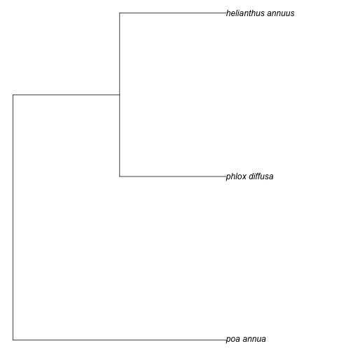
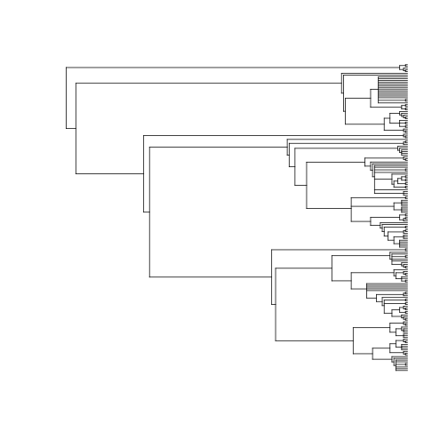

brranching
==========


[](http://www.repostatus.org/#active)
[](https://travis-ci.org/ropensci/brranching)
[](https://codecov.io/github/ropensci/brranching?branch=master)
[](https://cranchecks.info/pkgs/brranching)
[](https://github.com/metacran/cranlogs.app)
[](https://cran.r-project.org/package=brranching)

## Description

Brranching is an interface to many different sources of phylogenetic data (currently only from Phylomatic (http://phylodiversity.net/phylomatic/), but more sources to come) that allows users to query for phylogenetic data using taxonomic names.  

For `brranching::phylomatic_names()` function you should get an NCBI Entrez API key. NCBI Entrez doesn't require that 
you use an API key, but you get higher rate limit with a key, from 3 to 10 requests per second, so do 
get one. Run `taxize::use_entrez()` or see 
<https://ncbiinsights.ncbi.nlm.nih.gov/2017/11/02/new-api-keys-for-the-e-utilities/>
for instructions.

## Installation

Stable CRAN version


```r
install.packages("brranching")
```

Or dev version


```r
install.packages("devtools")
devtools::install_github("ropensci/brranching")
```


```r
library("brranching")
```

## Phylomatic


```r
taxa <- c("Poa annua", "Phlox diffusa", "Helianthus annuus")
tree <- phylomatic(taxa=taxa, get = 'POST')
plot(tree, no.margin=TRUE)
```



You can pass in up to about 5000 names. We can use `taxize` to get a random set of plant species names.


```r
library("taxize")
spp <- names_list("species", 200)
out <- phylomatic(taxa = spp, get = "POST")
plot(out, show.tip.label = FALSE)
```



## Meta

* Please [report any issues or bugs](https://github.com/ropensci/brranching/issues).
* License: MIT
* Get citation information for `brranching` in R doing `citation(package = 'brranching')`
* Please note that this project is released with a [Contributor Code of Conduct](CODE_OF_CONDUCT.md). By participating in this project you agree to abide by its terms.

[](https://ropensci.org)
